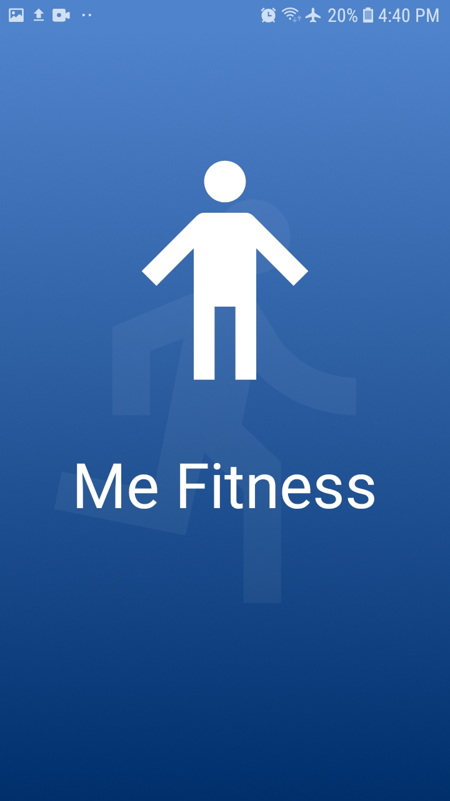
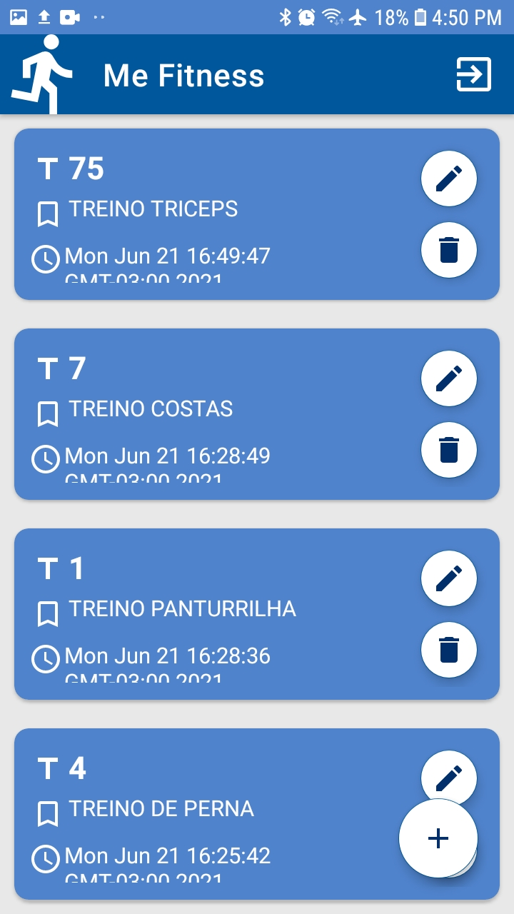
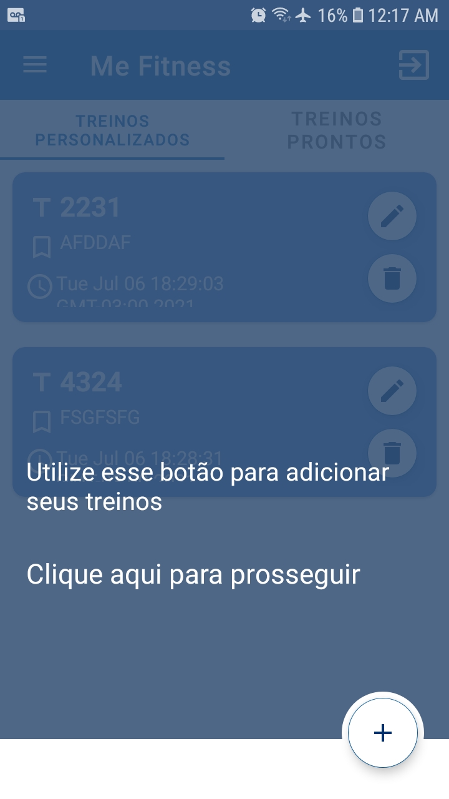
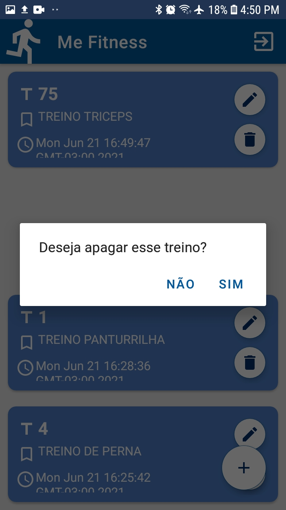
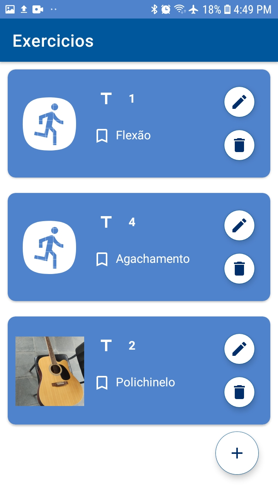
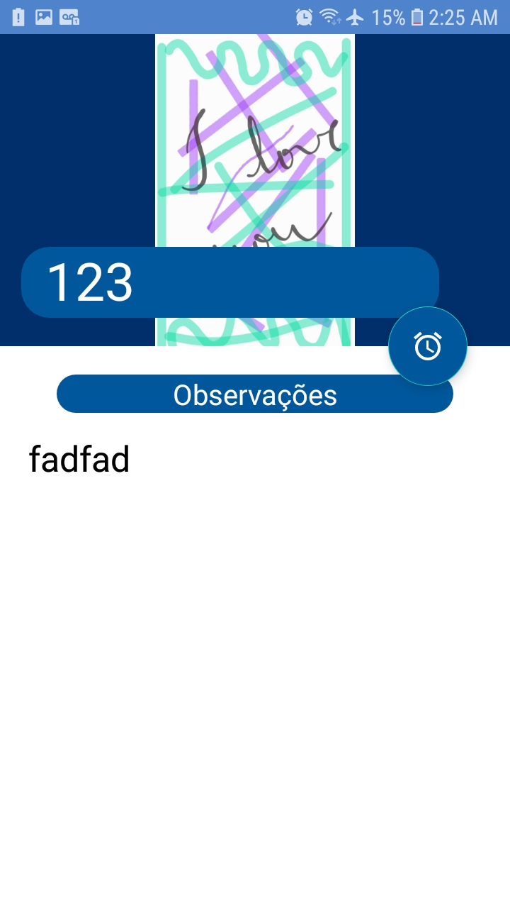
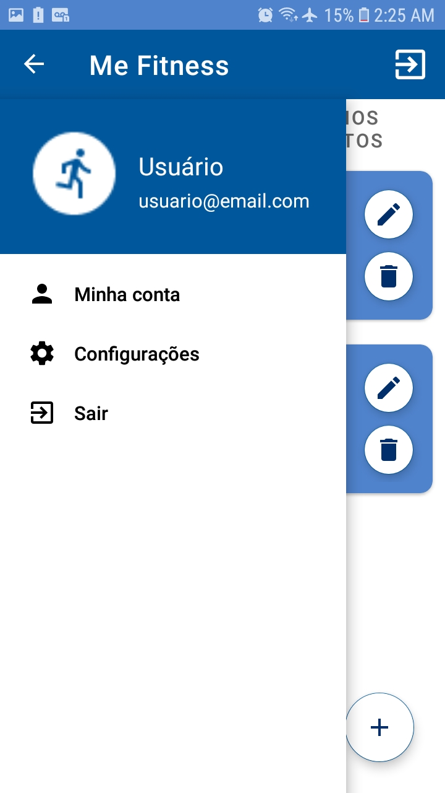

# MeFitness
 Aplicativo para gerenciamento de treinos.
 
Tecnologias:
<ul>
  <li>Android Studio</li>
  <li>Java</li>
  <li>Firebase Firestore</li>
  <li>Firebase Authentication</li>
  <li>Firebase Storage</li>
  <li>MaterialShowcaseView</li>
  <li>Glide</li>
 
</ul>

 

Screenshots:

 

</img >
<a href="https://giphy.com/gifs/VPtuA2YN43oC7zLtof">via GIPHY</a>

 

<figure>
	
</figure>

 

 

<figure>
	
</figure>

 

 

<figure>
	
</figure>

 

 

<figure>
	
</figure>

 

 

<figure>
	
</figure>

 

 

<figure>
	
</figure>

 

 

<figure>
	
</figure>

 

 

<figure>
	
</figure>
  
 

 

<figure>
	
</figure>
