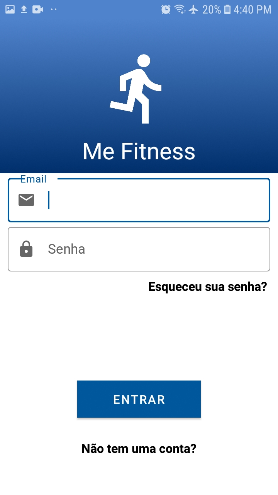

# MeFitness
 Aplicativo para gerenciamento de treinos.
 
Tecnologias:
<ul>
  <li>Android Studio</li>
  <li>Java</li>
  <li>Firebase Firestore</li>
  <li>Firebase Authentication</li>
  <li>Firebase Storage</li>
  <li>MaterialShowcaseView</li>
  <li>Glide</li>
 
</ul>

 

Screenshots:

 

<figure>
	
	<figcaption>Splash Screen </figcaption>
</figure>

 

 

<figure>
	
	<figcaption>Tela principal </figcaption>
</figure>

 

 

<figure>
	
	<figcaption>Tela principal - pesquisa por palavra chave </figcaption>
</figure>

 

 

<figure>
	
	<figcaption>Tela exibir notícia - resumo da notícia </figcaption>
</figure>

 

 

<figure>
	
	<figcaption>Tela exibir notícia - resumo da notícia, continuação com noticia completa abaixo </figcaption>
</figure>
  
