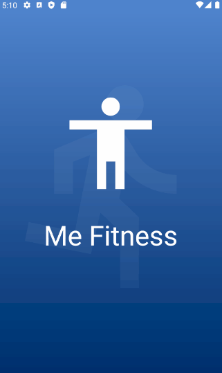

<h1 align="center">Me Fitness</h1>

<h4 align="center">Aplicativo para gerenciamento de treinos.</h4>

	
	
	
	

	
	
	
	

Tecnologias:
<ul>
  <li>Android Studio</li>
  <li>Java</li>
  <li>Firebase Firestore</li>
  <li>Firebase Authentication</li>
  <li>Firebase Storage</li>
  <li>Google Maps</li>
  <li>MaterialShowcaseView</li>
  <li>Shimmer Effect</li>
  <li>Glide</li>
  <li>Lottie</li>
</ul>

